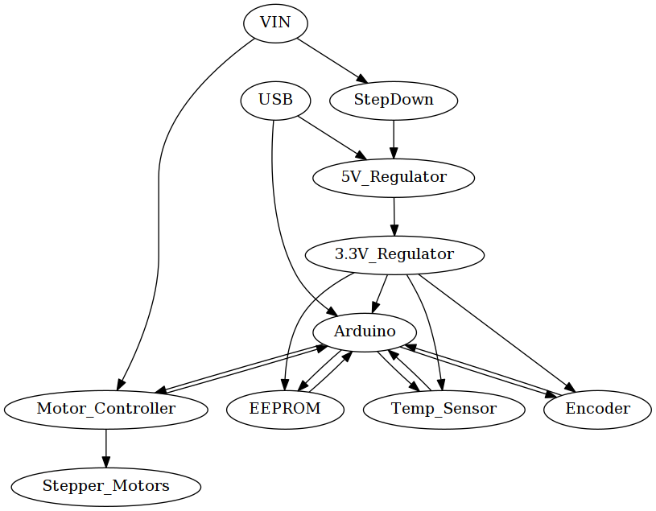

## Basic Design




#### Step Down

Converts VIN to about 5V


#### 3.3V Regulator

Converts the 5V coming from the Step Down, or otherwise coming from the USB input to 3.3V


#### Arduino Zero

Based on the Arduino Zero schematic


#### Encoder


#### Motor Controller


#### EEPROM

We have a 64kBit EEPROM, to store the calibration data in a persistent way (Otherwise it would be overwritten when flashing a new firmware).

We cannot store the calibration data in a simple key-value form which would require 2^14 values with 0.01° resolution. Because of that we need to store this table using compression algorithms.

Here is the idea of a simple compression algorithm, by storing the relative change of degree instead of an absolute position. We assume the value are monotonically increasing:

Every relative change is stored by a ```0```, followed by a specific amount of ```1``` Bits defining the offset to the previous value in 0.01° accuray. When we assume we have to map 360° on 0.01° accuray, using a sensor with 14bit accuray, we would need a table with the size of ```2^14+360*100 = 52384``` Bits which can be stored in a 64kBit EEPROM.

When we look onto the calibration routine, and using the informations about the algorithm used, we could probably further decrease the amount of data required to store the table.


#### Temperature Sensor

We have an I²C temperatur sensor on the pcb, to get the temperatur of the driver mosfets. There is furthermore a extension connector where we can attach two 1-Wire temperatur sensors to get the motor temperatur (or any other informations which could be usefull).
