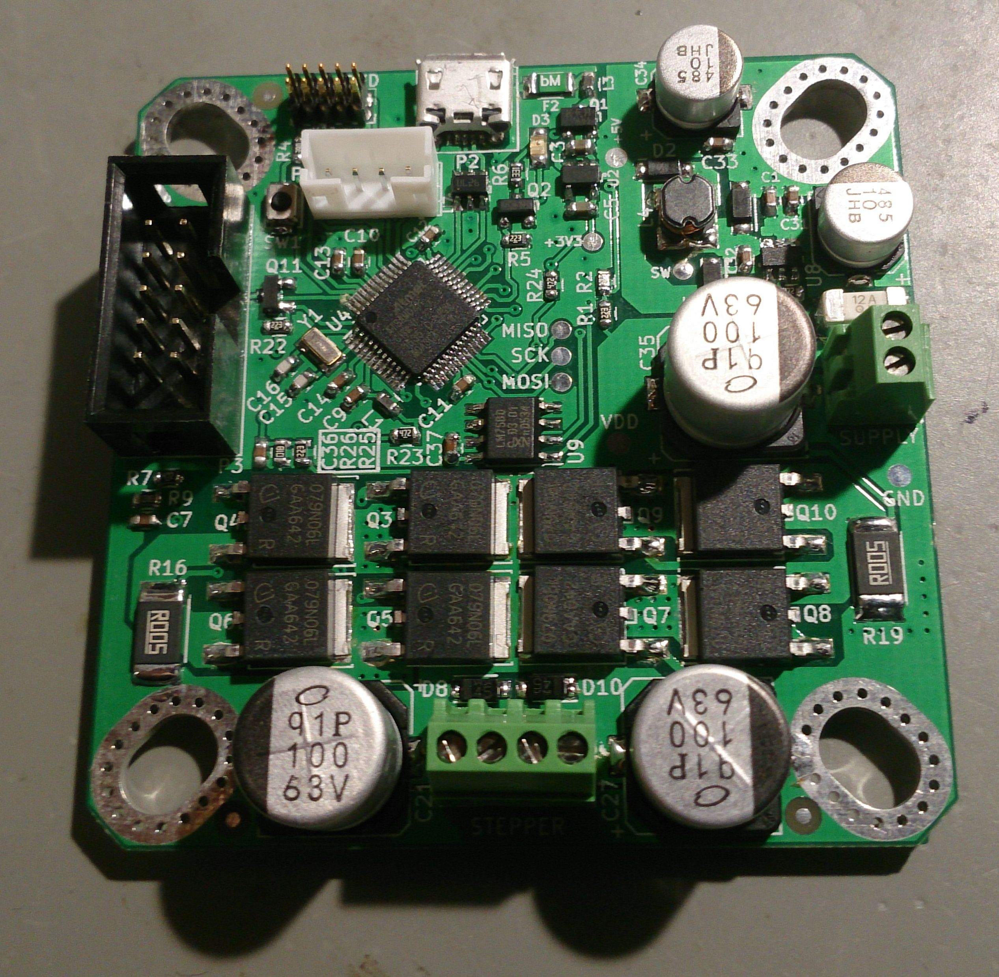
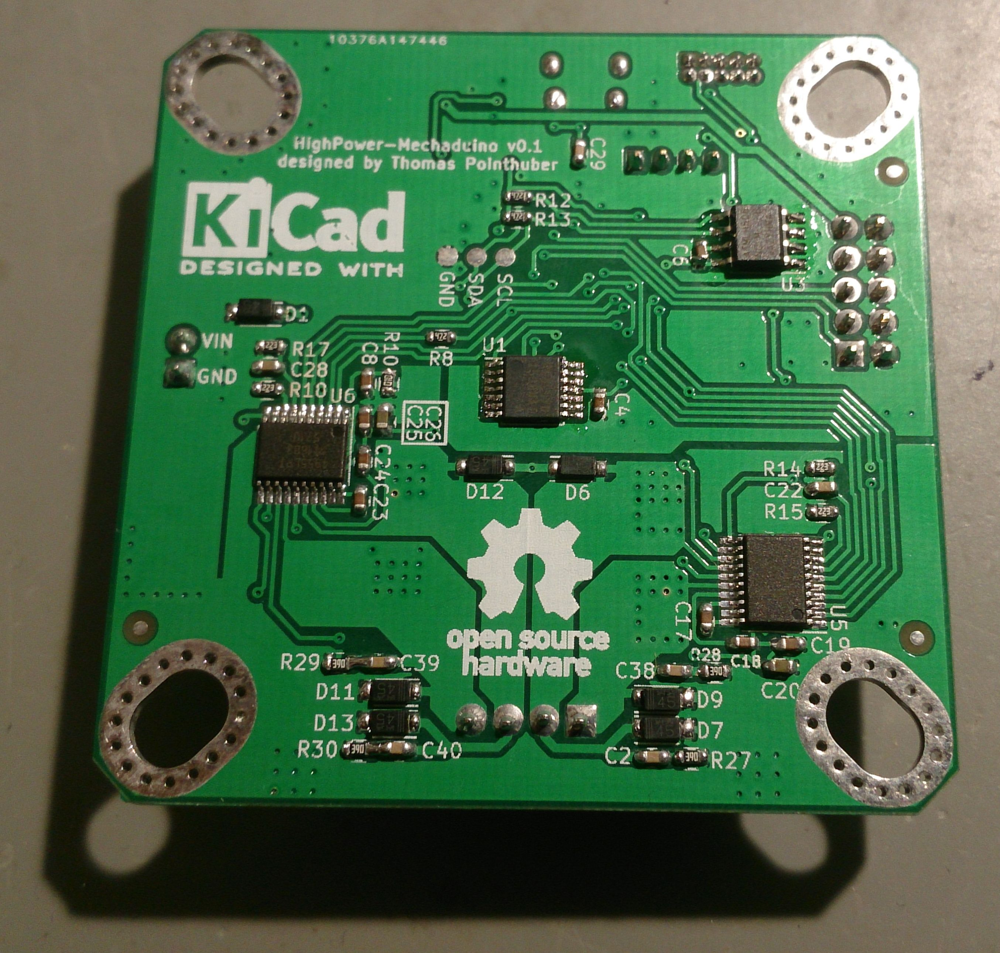

## PCB Assembly of first Prototype (v0.1) (18.03.2016)

### Assembly Order

1. Driver Mosfets, using a heating plate
2. Driver IC
3. SAMD21 ARM CPU
3. Chip SMD Capacitors
4. Chip SMD Resistors
5. Diodes
6. Fuses
7. Inductors
8. Remainig MosFET
9. Some IC's on the top side (regulator, temp-sensor)
10. Crystal
11. Switch
12. USB and SWD connector
13. Electrolyth Capacitors
14. Remaining Connectors
15. U1 and U3

required time for soldering: 4:30h

Top                                                             | Bottom
:--------------------------------------------------------------:|:-------------------------------------------------------------------:
  | 

### Problems found while Assembly

* R10 and R18 looks quite similar on pcb (via below silkscreen)
* A bit more thermal spaces to the pad's would be useful
* switch is note easy to reach

## First tests of the prototype

### Step Down measurements

The only connection to the board was the Supply voltage connected to the SUPPLY connector.

V_in    | I_in      | TP 5V     | TP 3.3V
--------|-----------|-----------|--------
4.3V    | 2.1mA     | 4.0V      | 3.33V
5.0V    | 2.3mA     | 4.5V      | 3.33V
6.0V    | 2.2mA     | 4.5V      | 3.33V
7.0V    | 2.2mA     | 4.5V      | 3.33V
10.0V   | 1.9mA     | 4.6V      | 3.33V
12.0V   | 2.0mA     | 4.6V      | 3.33V
15.0V   | 2.2mA     | 4.6V      | 3.33V
20.0V   | 2.4mA     | 4.6V      | 3.33V
25.0V   | 2.6mA     | 4.6V      | 3.33V
30.0V   | 2.8mA     | 4.6V      | 3.33V
35.0V   | 3.1mA     | 4.6V      | 3.33V
40.0V   | 3.5mA     | 4.6V      | 3.33V
45.0V   | 3.8mA     | 4.6V      | 3.33V
48.0V   | 4.0mA     | 4.6V      | 3.33V
50.0V   | 4.2mA     | 4.6V      | 3.33V

### Programming of Arduino Bootloader

Not done yet
